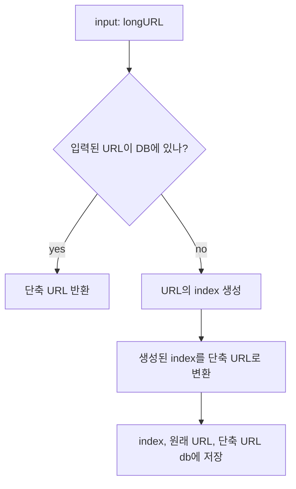

# 8장 - URL 단축기 설계

> 🤔 URL 단축기란 ?
https://www.systeminterview.com/q=chatsystem&c=loggedin&v=v3&l=long 과 같은 URL 을 https://www.systeminterview.com/y7ke-ocwj 와 같이 긴 URL 을 짧은 형태로 변환하여 사용자가 쉽게 공유하고 기억할 수 있도록 해주는 도구

## 1단계 문제 이해 및 설계 범위확정

시스템 설계 면접 문제는 의도적 어떤 정해진 결말을 갖지 않도록 만들어진다. 따라서 면접장에서 시스템을 성공적으로 설계해 내려면 질문을 통해 모호함을 줄이고 요구사항을 알아내야 함

**질문 예시**

```
🤔 어떻게 동작해야하는지 예시를 보여줄 주 있나요?
- https://www.systeminterview.com/q=chatsystem&c=loggedin&v=v3&l=long 과 같은 URL을 
https://www.systeminterview.com/y7ke-ocwj 와 같은 단축 URL을 제공해야 함
🤔 트랙픽 규모는 어느정도인가요?
- 매일 1억 개의 단축 URL을 만들어낼 수 있어야 함
🤔 길이는 어느 정도여야 하나요?
- 짧을수록 좋음
🤔 단축 URL에 포함될 문자에 제한이 있나요?
- 숫자와 영문자만 사용할 수 있음
🤔 단축 URL을 시스템에서 지우거나 갱신할 수 있나요?
- 시스템 단순화를 위해 지우거나 갱신은 할 수 없다고 가정
```

이 시스템의 기본적 기능은 다음과 같다

1. **URL 단축** : 주어진 긴 URL을 훨씬 짧게 줄인다.
2. **URL redirection** : 축약된 URL로 HTTP 요청이 오면 원래 URL로 안내
3. **높은 가용성과 규모 확장성**, 그리고 **장애 감내**가 요구됨

**개략적 추정**

- 쓰기 연산: 매일 1억 개의 단축 URL생성
- 초당 쓰기 연산 : 1억 / 24 / 300 = 1,160
- 읽기 연산 : 읽기 연산과 쓰기 연산 비율은 10:1이라고 가정
  - 초당 11,600회 발생
- URL 단축 서비스를 10년간 운영한다고 가정하면 1억 * 365 * 1 = 3,650억 개의 레코드를 보관해야 함
- 축약 전 URL의 평균 길이는 100이라고 가정
- 따라서 10년 동안 필요한 저장 용량은 3,650억 * 100 byte = 36.5TB 임

## 2단계 개략적 설계안 제시 및 동의 구하기

### API endpoint

REST API로 설계하는 것을 가장하고, URL 단축기는 기본적으로 두 개의 엔드포인트를 필요로 함

1. URL 단축용 엔드포인트 : 새 단축 URL을 생성하고자 하는 클라이언트는 이 엔드포인트에 단축할 URL을 인자로 실어서 POST 요청을 보내야 함

```
*POST /api/v1/data/shorten*

parameter : { longUrl: LongURLstring }
response : 단축 URL
```

1. URL redirection 용 엔드포인트 : 단축 URL에 대해서 HTTP 요청이 오면 원래 URL로 보내주기 위한 용도의 엔드포인트

```
*GET /api/v1/shortUrl*

response : 기존 URL
```

### URL Redirection

단축 UR을 받은 서버는 그 URL을 원래 URL로 바꾸어서 301 응답의 Locaiton 헤더에 넣어 반환

301 응답과 302 응답의 차이

- 301 Permanently Moved
  - 해당 URL에 대한 HTTP 요청의 처리 책임이 영구적으로 Locaiton 헤더에 반환된 URL로 이전되었다는 응답
  - 브라우저는 이 응답을 캐시함
- 302 Found
  - 주어진 URL로의 요청이 “일시적으로” Location 헤더 가 지정하는 URL에 의해 처리되어야 하는 응답
  - 따라서 클라이언트의 요청은 언제나 단축 URL 서버에 먼저 보내진 후 에 원래 URL로 리디렉션 되어야 함


서버의 부하를 줄이는 것이 중요하다면 301 응답을 사용하고, 트래픽 분석이 중요하다면 302 응답을 사용함

URL 리디렉션을 구현하는 가장 직관적인 방법은 해시 테이블을 사용하는 것이다.

- 원래 URL = hashTable.get(단축 URL)
- 301 또는 302 응답 Location 헤더에 원래 URL을 넣은 후 전송

### URL 단축

긴 URL을 해시 값으로 대응시킬 해시 함수를 찾은 것이고 이 함수는 다음 요구사항을 만족해야한다.

- 입력으로 주어진 긴 URL 이 다른 값이면 해시 값도 달라짐
- 계산된 해시 값은 원래 입력으로 주어졌던 긴 URL로 복원될 수 있어야 함

## 3단계 상세 설계

### 데이터 모델

해시 테이블 접근법은 초기 전략으로는 괜찮지만 실제 시스템에서 쓰기에는 메모리는 유한한 데다 비싸기 때문에 사용하기 어려움

따라서 관계형 데이터베이스에 <단축 URL, 원래 URL> 의 순서쌍을 저장하는 것이 좋음

### 해시 함수

원래 URL을 단축 URL로 변환하는데 사용

**해시 값 길이**

hashValue 는 [0-9, a-z, A-Z]의 문자들로 구성되기 때문에 사용할 수 있는 문자의 개수는 62개 따라서 62^n ≥ 365B 인 n의 최솟값을 찾아야 함

→ 62^7 ≥ 3.5T 이기 때문에 길이는 7로 가정

**해시 후 충돌 해소**

CRC23, MD5, SHA-1 와 같이 잘 알려진 해시 함수는 최소 8자이기 때문에 요구사항에 맞게 길이를 줄이는 과정이 필요

제일 간단한 방법은 계산된 해시 값에서 처음 7개 글자만 이용

- 해시 결과가 충돌할 확률이 높음
- 충돌일 발생했을 때 충돌이 해소될 때까지 사전에 정한 문자열을 해시값에 덧붙임
- 한 번 이상 데이터베이스 접근하기 때문에 오버헤드가 큼 → 데이터베이스 대신 블룸 필터 사용하면 성능을 높일 수 있음

**base-62 변환**

base conversion은 URL 단축기를 구현할 때 흔히 사용되는 접근법

이 기법은 수의 표현 방식이 다른 두 시스템이 같은 수를 공유하여야 하는 경우에 유용함

> 🤔 URL 은 문자로 구성되어있는데 어떻게 진법을 사용하지 ?
> - 이 과정에서는 우선 각 URL에 고유한 식별자가 할당되는이 이 식별자로 base62 인코딩함
> - 또는 URL을 UTF-8 로 인코딩하여 이진 데이터로 변환 후 base62 인코딩할 수도 있음
>
> 출처: ChatGPT

```python
def base62(index):
  characters = "0123456789ABCDEFGHIJKLMNOPQRSTUVWXYZabcdefghijklmnopqrstuvwxyz"
  result = ""
  while index > 0:
    result = characters[index % 62] + result
    index = index // 62
  return result
```

**두 접근법 비교**

| 해시 후 충돌 해소 전략               | base-62 변환                                                                   |
|-----------------------------|------------------------------------------------------------------------------|
| 단축 URL의 길이가 고정됨             | 단축 URL의 길이가 가변적 → ID값이 커지면 같이 길어짐                                            |
| 유일성이 보장되는 ID 생성기가 필요없음      | 유일성 보장 ID 생성기 필요                                                             |
| 충돌이 가능해서 해소 전략 필요           | 충돌 없음                                                                        |
| 다음에 쓸 수 있는 URL을 알아내는 것이 어려움 | ID를 auto_increment 로 생성할 경우 다음에 쓸 수 있는 URL이 무엇인지 알아낼 수 있기 때문에 보안상 문제 생길 수 있음 |

### URL 단축기 상세 설계

URL 단축기는 시스템의 핵심 컴포넌트이므로, 그 처리 흐름이 논리적으로 단순해야 하고 기능적으로 언제나 동작하는 상태로 유지되어야 함

**처리 흐름**



1. 입력으로 긴 URL을 받음
2. 데이터베이스에 해당 URL이 있는지 검사
3. 데이터베이스에 있다면 해당 URL에 대한 단축 URL 반환
4. 데이터베이스에 없는 경우 URL의 index 를 생성
5. index를 base-62 활용하여 단축 URL 생성
6. index, 원래 URL, 단축 URL db에 저장

> **💡 참고 💡**
> - id 생성기는 globally unique 를 보장해야 함


### URL 리디렉션 상세 설계


URL 리디렉션 메커니즘은 읽기 보다 쓰기를 더 자주 하는 시스템이라 캐시를 활용하는 것이 성능에 좋음

## 4단계 마무리

추가적 논의거리

1. rate limiter
2. web server scaling
3. database server scaling
4. data analytics
5. availability, consistency, reliability